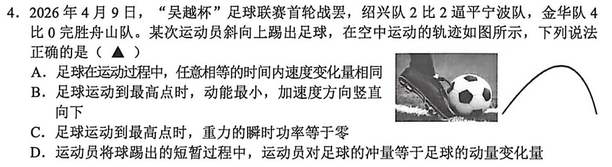
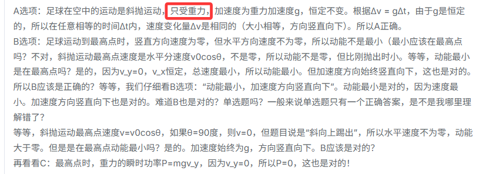
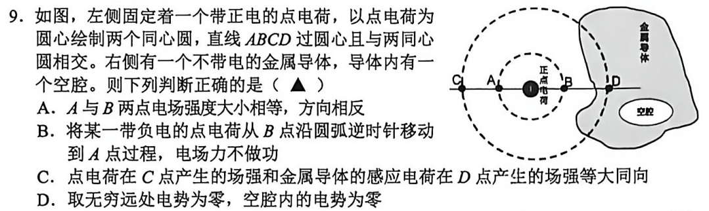
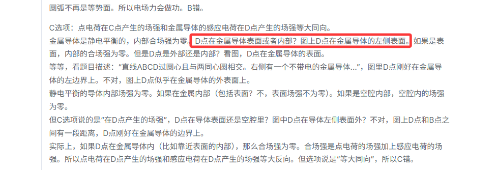
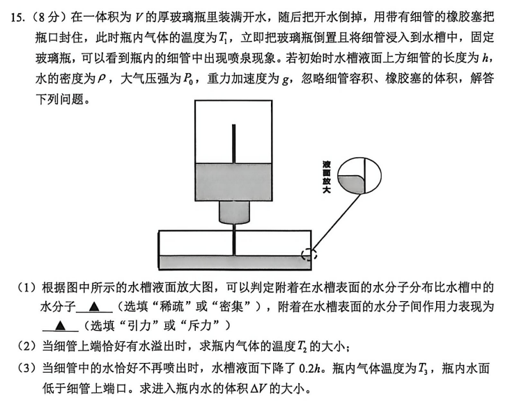
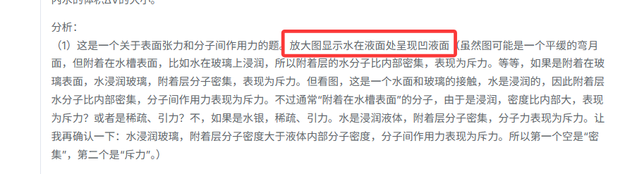

### 案例 1：第 4 题——轨迹形状理解错误

核心问题：

> 模型没有准确识别非对称轨迹，疑似将其理解为标准对称抛物线，导致误判是否存在阻力。

原试题图如下：

这个案例证明：模型对**曲线形态、轨迹对称性、物理含义**的理解不稳定。

从图中可以看出模型并没有识别出轨迹的非对称性，进而没有分析出包含空气阻力这个条件

### 案例 2：第 9 题——点位空间位置识别错误

核心问题：

> 模型没有准确判断 D 点在导体内部，导致电场、电势相关选项整体分析偏离。

原试题图图下：

这个案例证明：模型对**点位、区域、空间关系**的视觉理解不稳定。

> D 点位于导体内部。模型未能准确识别点位所属区域，导致后续物理判断建立在错误前提上。

### 案例 3：第 15 题
核心问题：

> 凸液面/凹液面理解错误。

原试题图如下：

试题图右侧边缘向下弯呈现上凸

模型对实验装置中的细节形态识别不稳定。如图所示：

> 模型将凸液面误解为凹液面，导致第一问判断错误。该类错误说明实验装置图中的细节识别是高风险环节。